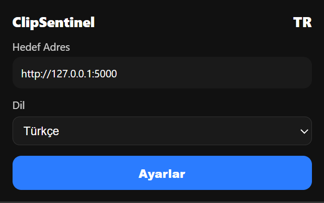
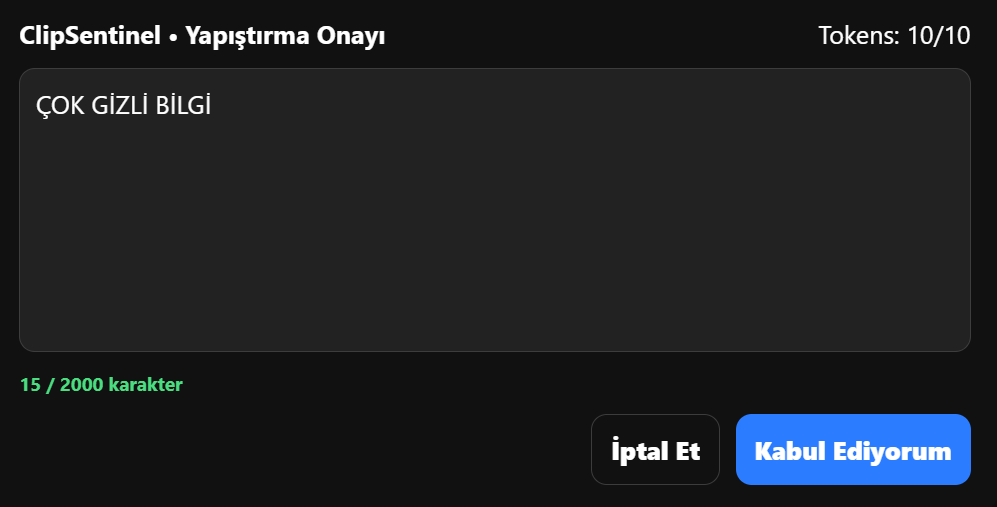
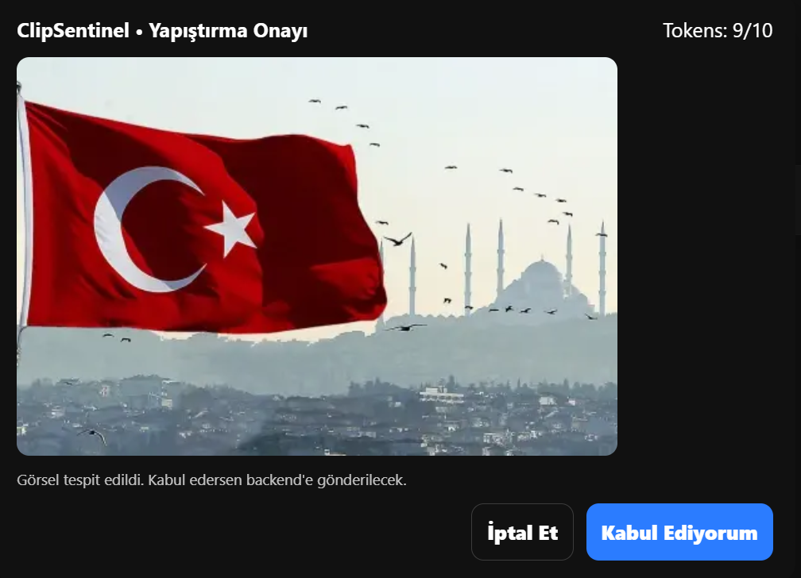
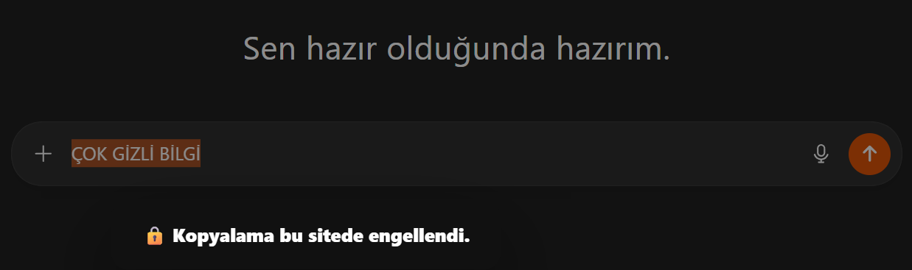
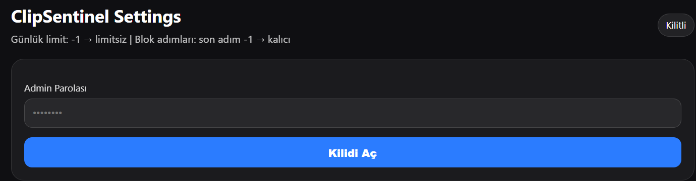
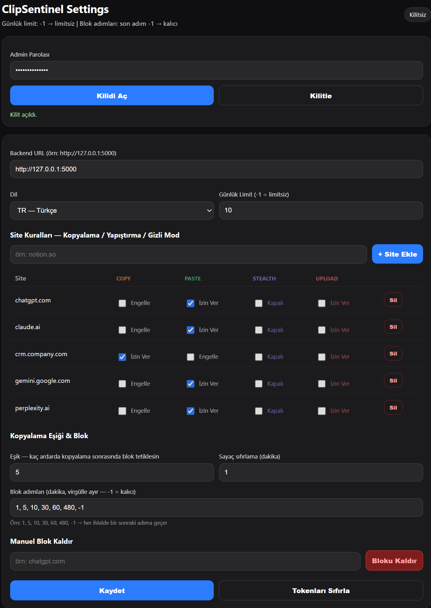
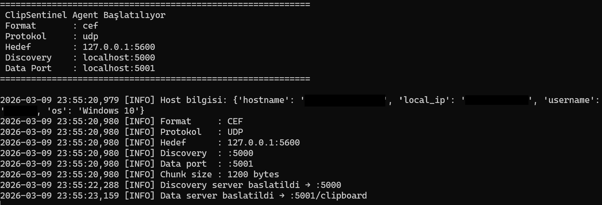
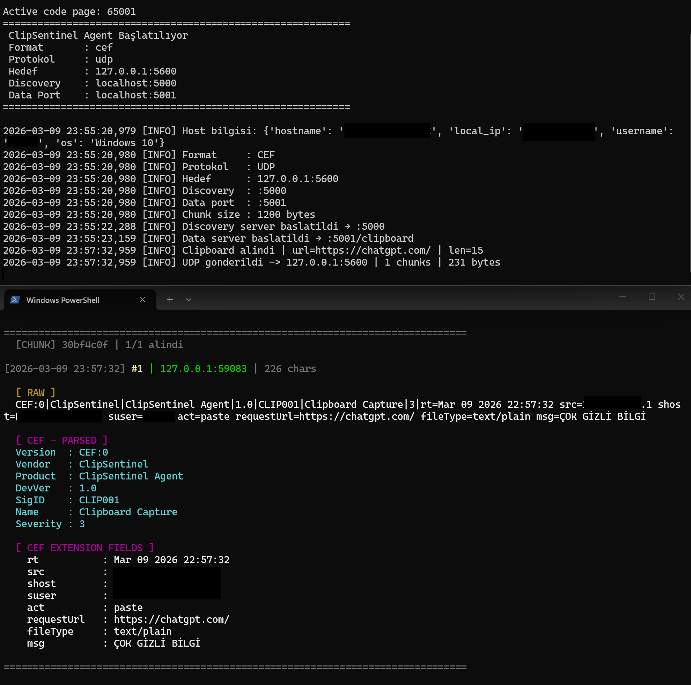

# ClipSentinel

A lightweight Chrome extension that monitors copy/paste operations in the browser to prevent sensitive data leakage.
Designed for SOC and IT security teams in enterprise environments, with DLP and insider threats in mind.

---

## What does it do?

When a user copies or pastes on a page, the extension intercepts the action. It captures the content locally, checks the daily usage limit, prompts the user for confirmation, and forwards the data to the background agent.

---

## Features

**Chrome Extension**
- Copy and paste interception — real-time, via `copy` and `paste` events
- User confirmation screen — with text or image content preview
- Character limit enforcement (default: 2000 characters)
- Daily token/paste limit management
- Threshold-based automatic copy blocking — repeated copies trigger escalating block durations (`blockSteps`)
- Per-site rules — `Copy`, `Paste` configurable separately for each domain
- Stealth mode — silently logs without showing anything to the user
- Image paste support — preview + base64 upload to backend
- Admin panel (password-protected) — settings, site rules, block management
- TR / EN / DE language support

**Agent (`clipsentinel_agent.py`)**
- Two HTTP servers: discovery (default `:5000`) and data (`:5001`)
- JSON and CEF output formats
- TCP and UDP protocol support
- UDP chunking — large packets are split as `CLIP|<id>|<idx>/<total>|<data>`
- Host info (hostname, IP, username, OS) appended to every payload

**Listener (`listener.ps1`)**

A UDP listener for development and testing. Reassembles chunks and displays CEF and JSON payloads in a readable, colorized terminal output.

---

## Screenshots

### Popup


### Text Paste Confirmation


### Image Paste Confirmation


### Copy Block


### Admin Login


### Settings Panel


### Agent Output


### SIEM / Backend Output


---

## Installation

```bash
git clone https://github.com/selimkartaal/ClipSentinel.git
```

Go to `chrome://extensions`, enable Developer mode, and click "Load unpacked" to load the `Chrome Extension/` folder.

For enterprise deployment, centralized management via GPO or MDM is recommended.

---

## Configuration

The admin password is stored as a SHA-256 hash inside `background.js`.
Settings are persisted in `chrome.storage.local` and managed via the Options page.

```js
{
  discoveryUrl: "http://127.0.0.1:5000",
  language: "EN",                           // TR | EN | DE
  dailyLimit: 10,                           // -1 = unlimited
  siteRules: {
    "chatgpt.com":     { canCopy: false, canPaste: true,  stealthCopy: false },
    "claude.ai":       { canCopy: false, canPaste: true,  stealthCopy: false },
    "crm.company.com": { canCopy: true,  canPaste: false, stealthCopy: false }
  },
  blockSteps: [1, 5, 10, 30, 60, 480, -1], // minutes; -1 = permanent
  counterResetMinutes: 1,
  copyThreshold: 5
}
```

---

## Agent

```bash
python clipsentinel_agent.py --format cef  --protocol udp --target 192.168.1.100:5600
python clipsentinel_agent.py --format json --protocol tcp --target 192.168.1.100:5600
```

| Parameter | Description | Default |
|-----------|-------------|---------|
| `--format` | `json` \| `cef` | required |
| `--protocol` | `tcp` \| `udp` | required |
| `--target` | `IP:PORT` | required |
| `--discovery-port` | Discovery HTTP port | `5000` |
| `--data-port` | Clipboard data HTTP port | `5001` |
| `--chunk-size` | UDP max packet size (bytes) | `1200` |

Use `start_agent.bat` to configure parameters and start with a single click.

---

## Listener (PowerShell)

```powershell
.\listener.ps1 -Port 5600
```

Collects incoming UDP packets, reassembles chunks, and parses CEF and JSON formats with colorized output.

---

## Backend Payload

```json
{
  "act": "paste",
  "type": "text",
  "mime": "text/plain",
  "data": "...",
  "pageUrl": "https://chatgpt.com",
  "timestamp": "2025-01-01T00:00:00.000Z"
}
```

The agent enriches this payload with host information (hostname, IP, username, OS) and forwards it to the target SIEM/listener.

---

## Use Cases

- Insider threat prevention
- DLP workflows
- AI prompt security (default rules included for ChatGPT, Claude, Gemini, etc.)
- SIEM / SOAR integration (CEF or JSON)

---

## Splunk Integration

### Index & Sourcetype

```
index=clipsentinel sourcetype=clipsentinel:paste
```

```ini
# inputs.conf
[http://clipsentinel]
token = <HEC_TOKEN>
index = clipsentinel
sourcetype = clipsentinel:paste

# props.conf
[clipsentinel:paste]
KV_MODE = json
TIME_PREFIX = "timestamp":
TIME_FORMAT = %s
```

---

### Basic Queries

**List all events**
```spl
index=clipsentinel sourcetype=clipsentinel:paste
| table _time, host, username, pageUrl, act, mime, data
| sort -_time
```

**Copy block events**
```spl
index=clipsentinel sourcetype=clipsentinel:paste act="copy_threshold_block"
| table _time, host, username, pageUrl
| sort -_time
```

**Credit card detection**
```spl
index=clipsentinel sourcetype=clipsentinel:paste
| rex field=data "(?P<cc>4[0-9]{12,15}|5[1-5][0-9]{14}|3[47][0-9]{13})"
| eval cc_masked="****-****-****-"+substr(cc,-4)
| table _time, host, username, pageUrl, cc_masked
```

**IBAN detection**
```spl
index=clipsentinel sourcetype=clipsentinel:paste
| rex field=data "(?P<iban>[A-Z]{2}\d{2}[0-9A-Z]{11,30})"
| eval iban_masked=substr(iban,1,4)+"****"+substr(iban,21,6)
| table _time, host, username, pageUrl, iban_masked
```

**Keyword analysis**
```spl
index=clipsentinel sourcetype=clipsentinel:paste
| eval hit=case(
    match(data,"(?i)confidential|secret|password|api.?key|token"),"sensitive_keyword",
    match(data,"(?i)private|internal.?only"),"classification_keyword",
    true(),"none")
| where hit!="none"
| stats count by hit, username, host
| sort -count
```

---

### Correlation Rules

**High paste volume in short time**
```spl
index=clipsentinel sourcetype=clipsentinel:paste
| bucket _time span=15m
| stats count as event_count by _time, username, host
| where event_count >= 10
| eval alert="15 min: "+event_count+" paste events by "+username
```

**After-hours activity**
```spl
index=clipsentinel sourcetype=clipsentinel:paste
| eval hour=strftime(_time,"%H")
| where hour<8 OR hour>18
| table _time, host, username, pageUrl
| sort -_time
```

**Paste to suspicious domains**
```spl
index=clipsentinel sourcetype=clipsentinel:paste
| where match(pageUrl,"pastebin\.com|hastebin\.com|ghostbin\.com|0bin\.net")
| table _time, host, username, pageUrl
```

---

### Regex Reference

| Data Type | Regex |
|-----------|-------|
| SSN (US) | `\b\d{3}-\d{2}-\d{4}\b` |
| IBAN | `[A-Z]{2}\d{2}[0-9A-Z]{11,30}` |
| Credit Card | `4[0-9]{12,15}\|5[1-5][0-9]{14}\|3[47][0-9]{13}` |
| Email | `[a-zA-Z0-9._%+\-]+@[a-zA-Z0-9.\-]+\.[a-zA-Z]{2,}` |
| Phone (US) | `(?:\+1[\s\-]?)?\(?\d{3}\)?[\s\-]?\d{3}[\s\-]?\d{4}` |

---

## Roadmap

- Centralized management dashboard (agent view)
- Policy-based content engine (BLOCK / WARN / LOG / ALLOW)
- ML-powered risk scoring
- LLM-based content classification
- Native alert generation (no SIEM required)
- Tenant-based usage tracking
- SOAR playbook integration
- Firefox / Edge support

---